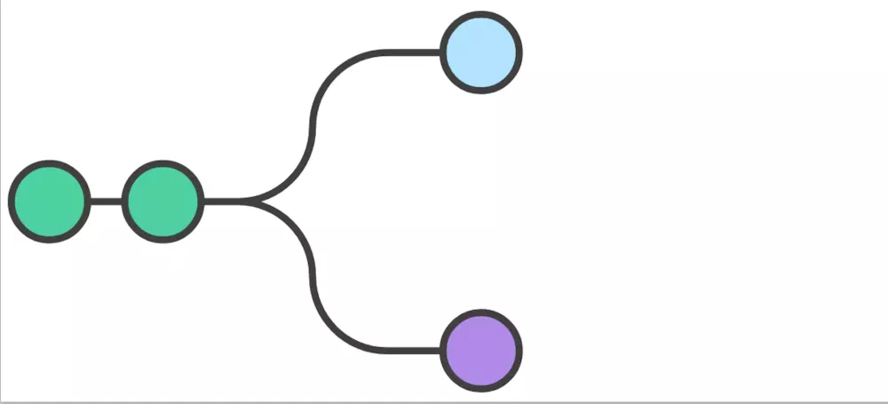
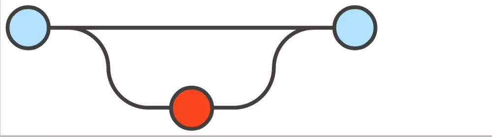

# Git Flow

## 命名约定

- 主分支名称：master
- 主开发分支名称：develop
- 标签（tag）名称：v*，其中”*“ 为版本号，如：v1.0.0
- 新功能开发分支名称：feature/\*，其中“\*” 为新功能简述，如：feature/item-activity-list
- 发布分支名称：release/\*，其中*为版本号，“release”小写，如：release/1.0.0
- 修复分支名称：hotfix/\*，其中*为 bug 简述，如：hotfix/item-update-bug

## 工作流程

### 工作流的基础

创建 develop 分支

- 项目负责人在本地 master 基础上创建一个 develop 分支，然后，推送到服务器；

  `git branch develop`

  `git push -u origin develop`

- 其他开发人员，需要克隆 develop 中央仓库的源码，创建一个 develop 的轨迹版本；如果，已经克隆过该项目，则不需要执行以下第一条命令。

  `git clone git@github.org:search-cloud/demo.git`

  `git checkout -b develop origin/develop`

develop 这个分支将包含项目的完整历史记录，而 master 将包含缩略版本。

### 新功能开发流程

#### 1.新建 feature 分支

基于 develop 分支创建新功能分支：

`git checkout -b feature/demo develop`

推送到远程仓库，共享：

`git push`

所有开发此新功能的人员，都在此分支上开发提交代码。

`git status`

`git add`

`git commit -m "Add some-file."`

#### 2.完成新功能开发（合并 feature 分支到 develop）

当确定新功能开发完成，且联调测试通过，并且新功能负责人已经得到合并 feature 分支到 develop 分支的允许；这样才能合并 feature 分支到 develop。

`git pull origin develop`

`git checkout develop`

`git merge feature/demo`

`git push`

`git branch -d feature/demo`

第一条命令是确保在合并新功能之前，develop 分支是最新的。

注意：

- 新功能分支，永远不要直接合并到 master 分支。 
- 合并可能会有冲突，应该谨慎处理冲突。

#### 3.在测试环境发布 develop 分支代码（提交测试）

### 线上版本发布流程

#### 1.从 develop 中创建准备发布的 release 分支

当主测试流程完成，源码已经趋近于稳定状态，应该准备一个发布版本，确立版本号：

`git checkout -b release/0.1.0 develop`

推送到远程仓库共享：

`git push`

这个分支是清理准备发布、 整体回归测试、 更新文档，和做其他任何系统即将发布的事情。

#### 2.继续抛光改 bug

#### 3.release 分支合并到 master 发布

一旦已经满足发布条件（或已经到了预定发布日期），应该把 release 分支合并到 master 分支和 develop 分支中，然后，使用 master 发布新版本。合并 release 分支到 develop 分支是很重要的，要让 release 上修改的东西能在后续的开发分支中生效。

`git checkout master`

`git merge release/0.1.0`

`git push`

#### 4.release 分支合并到 develop

`git checkout develop`

`git merge release/0.1.0`

`git push`

`git branch -d release/0.1.0`

#### 5.打标签

release 分支在功能开发分支（develop）和公共发布版（master）中，充当一个缓冲的作用。每当有源码合并到 master 中的时候，应该在 master 上打一个标签，以便后续跟踪查阅。

`git tag -a v0.1.0 -m "Initial public release" master`

`git push --tags`

### 线上 Bug 修复流程

当终端用户，反馈系统有 bug 时，为了处理 bug，需要从 master 中创建出保养分支；等到 bug 修复完成，需要合并回 master：

#### 1.创建 hotfix 分支

`git checkout -b hotfix/#001 master`

#### 2.修改 bug

#### 3.完成修复，合并到 master 发布

`git checkout master`

`git merge hotfix/#001`

`git push`

#### 4.打标签

`git tag -a v0.1.1 -m "Initial public release" master`

`git push --tags`

#### 5.合并到 develop

`git checkout develop`

`git merge hotfix/#001`

`git push`

## 参考资料

- [Git Flow工作流程](https://www.jianshu.com/p/9a76e9aa9534)
- [GitFlow工作流常用操作流程](https://blog.csdn.net/zsm180/article/details/75291260)
